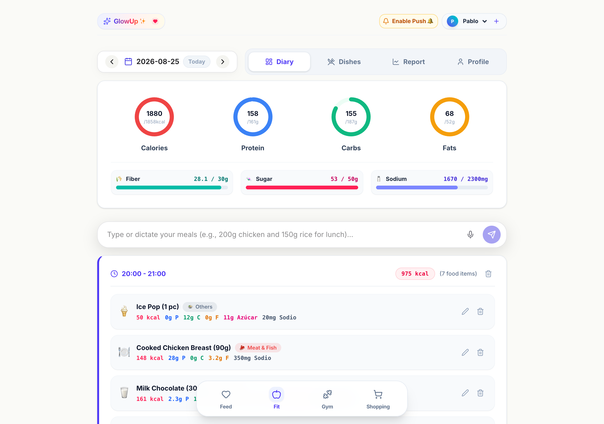
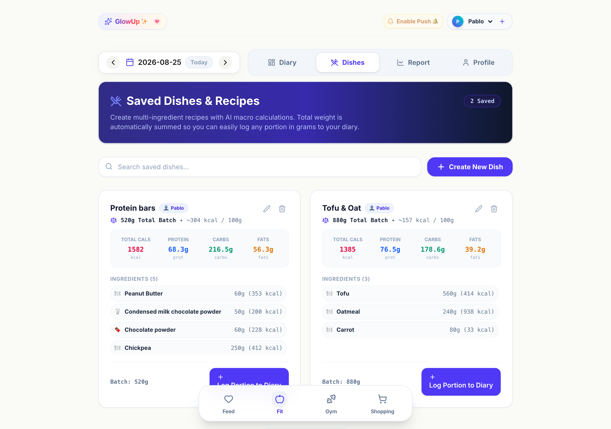
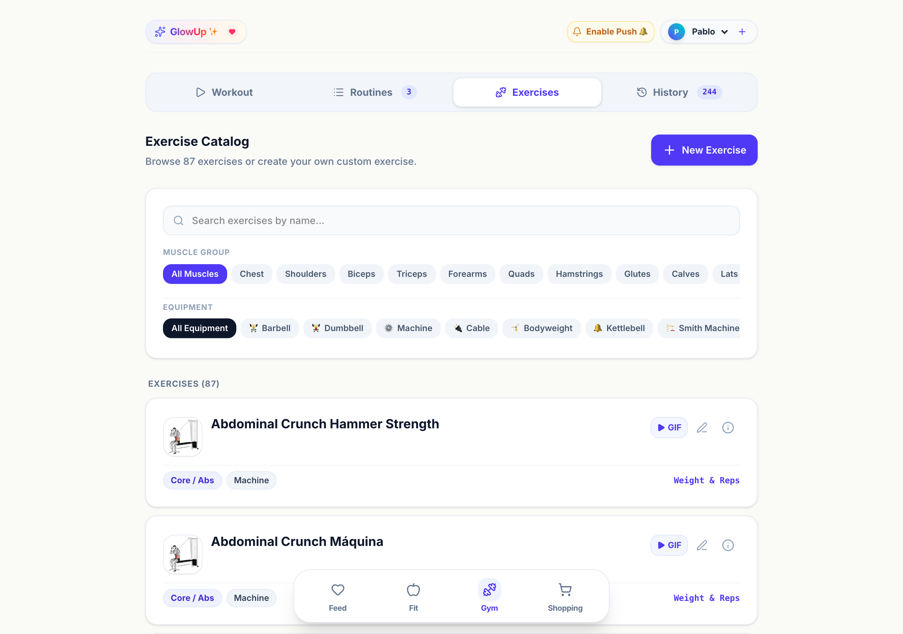
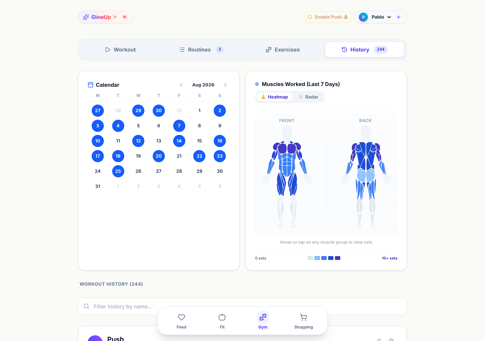
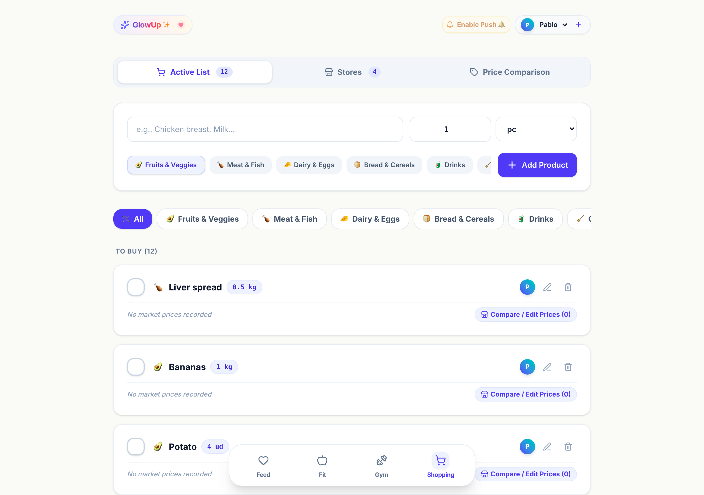
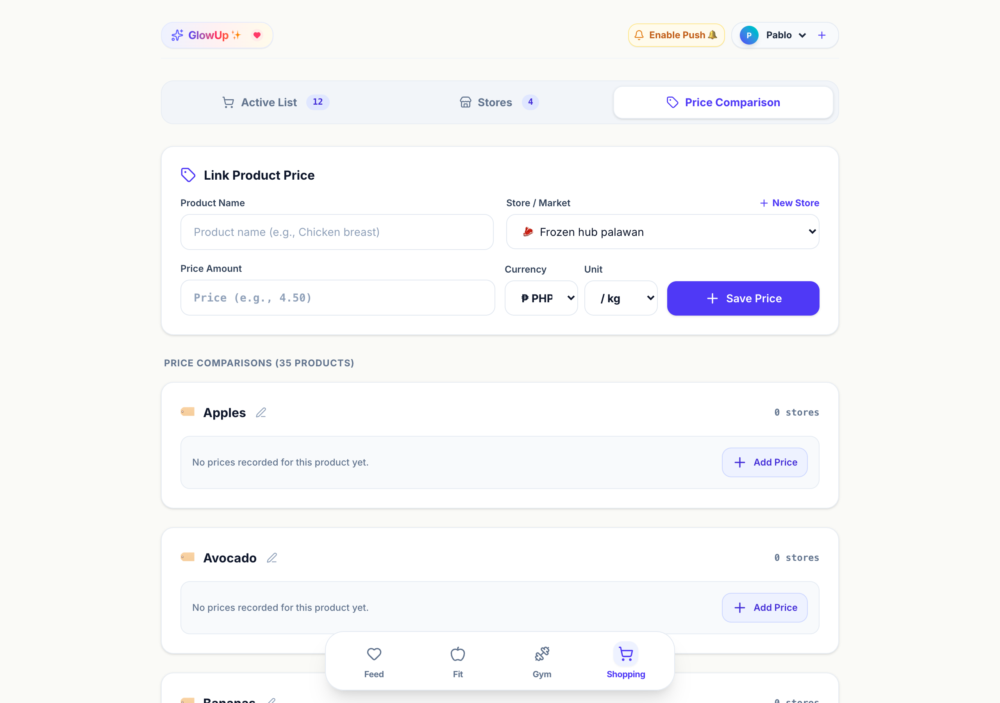
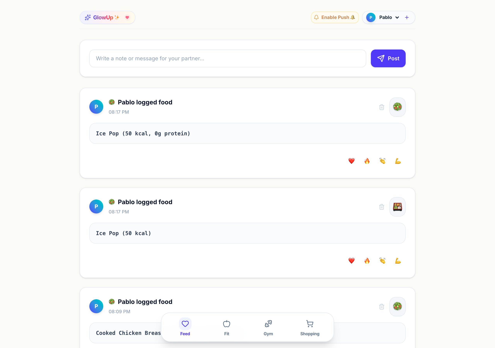
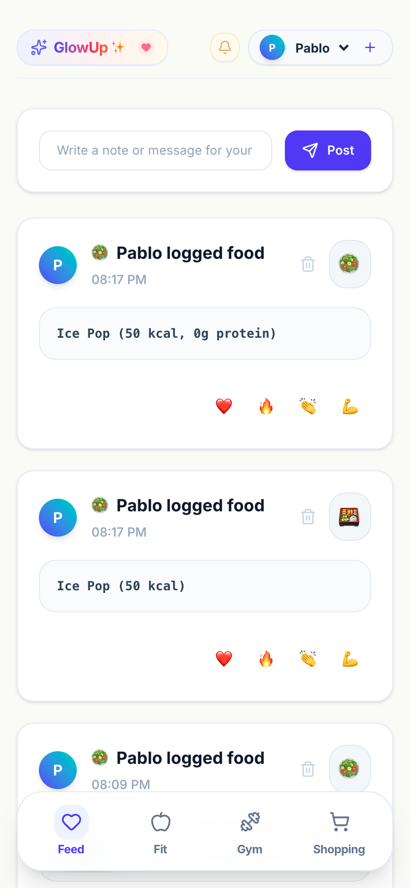
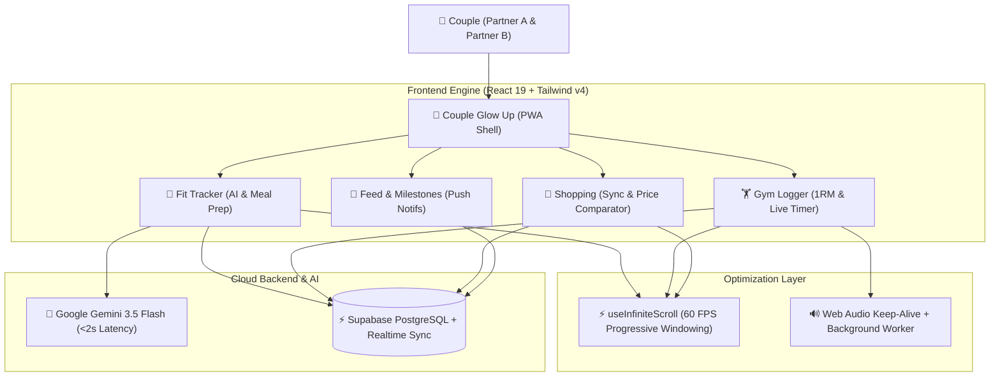

<div align="center">

# 💖 Couple Glow Up ✨
### *The Ultimate Collaborative Fitness, Nutrition & Lifestyle PWA for Couples*

[](https://vitejs.dev/)
[](https://react.dev/)
[](https://tailwindcss.com/)
[](https://supabase.com/)
[](https://ai.google.dev/)
[](https://web.dev/progressive-web-apps/)
[](https://vitest.dev/)
[](https://opensource.org/licenses/MIT)

<br />

<p align="center">
  <strong>Transform your health journey together.</strong><br />
  Track daily nutrition with AI parsing, log workouts with Hevy-style precision & animated technique GIFs, sync shopping lists across supermarkets in real time, and celebrate shared milestones.
</p>

[**🌐 Explore Live App**](https://phmmyadmin.github.io/couple-glow-up/) · [**📱 Install PWA**](#-progressive-web-app--offline-first) · [**🧪 Test Suite**](#-test-driven-development-tdd--quality-assurance) · [**🚀 Quickstart**](#-quickstart--local-development)

<br />

<!-- Hero Preview -->
<a href="https://phmmyadmin.github.io/couple-glow-up/">
  
</a>

</div>

<br />

---

## 📸 Visual Showcase & Screenshots

<div align="center">

### 🥗 Fit & Nutrition — AI Food Diary & Batch Meal Prep

| Daily Timeline & Macro Rings | Custom Dishes & Batch Recipe Scaler |
| :---: | :---: |
|  |  |
| *Real-time calories, macros, micronutrients & AI log* | *Automatic gram scaling for batch prep recipes* |

<br />

### 🏋️‍♂️ Gym & Workouts — Exercise Catalog & Muscle Heatmap

| 87+ Exercise Catalog & Animated GIFs | Muscle Heatmap & Workout Calendar |
| :---: | :---: |
|  |  |
| *Filtered by equipment, muscle group & animated GIFs* | *Weekly muscle fatigue distribution & session history* |

<br />

### 🛒 Shopping & Price Comparator · 💖 Couple Feed

| Real-Time Shopping List | Multi-Market Price Comparator | Couple Milestones Feed |
| :---: | :---: | :---: |
|  |  |  |
| *Synchronized item checklist* | *Cheapest store finder* | *Shared notes & emoji reactions* |

<br />

### 📱 Responsive Mobile PWA Interface



</div>

---

## 🎬 Animated Technique GIFs

Every exercise in the catalog includes instant technique instructions, targeted muscle groups, equipment tags, and smooth **60 FPS animated demonstrations**:

<div align="center">

| Barbell Bench Press | Barbell Back Squat | Cable Lat Pulldown | Standing Biceps Curl |
| :---: | :---: | :---: | :---: |
|  |  |  |  |
| `Chest · Triceps · Shoulders` | `Quads · Glutes · Hamstrings` | `Lats · Biceps · Upper Back` | `Biceps · Forearms` |

</div>

---

## 🌟 Highlights & Core Modules

<table>
  <tr>
    <td width="50%" valign="top">
      <h3>🥗 1. AI Nutrition & Macro Tracker (Fit)</h3>
      <ul>
        <li><strong>⚡ Gemini 3.5 Flash Instant Parsing:</strong> Natural language food logging with sub-2s response latency.</li>
        <li><strong>🍲 Multi-Ingredient Batch Recipes (<code>DishesView</code>):</strong> Create complex meal prep batches. Input any portion in grams to automatically scale calories, macros, and micronutrients (Fiber, Sugar, Sodium).</li>
        <li><strong>🎯 Adaptive TDEE & Deficit Calculator:</strong> Mifflin-St Jeor formula integration with calorie deficit countdown and rolling 7-day weight moving average.</li>
        <li><strong>📊 Interactive Macro Rings:</strong> Real-time visual progress rings for Calories, Protein, Carbs, and Fats.</li>
      </ul>
    </td>
    <td width="50%" valign="top">
      <h3>🏋️‍♂️ 2. Hevy-Style Gym Tracker & Analytics</h3>
      <ul>
        <li><strong>⚡ Live Workout Logger:</strong> Set types (Warmup, Normal, Drop, Failure), 1RM calculation (Epley formula), RPE/RIR logging, and automatic PR detection.</li>
        <li><strong>🎬 87+ HD Animated Exercise GIFs:</strong> High-definition demonstration videos and muscle targeting for every exercise.</li>
        <li><strong>🧠 Smart Progressive Overload Engine:</strong> Double progression model recommending weight/rep increments based on past performance.</li>
        <li><strong>🧬 Muscle Heatmap & Volume Radar:</strong> Interactive SVG anatomical body map highlighting fatigued muscles and weekly set volumes.</li>
        <li><strong>⏱️ Web Audio Rest Timer:</strong> Background countdown with audio chime, haptic vibration, and native system push notifications.</li>
      </ul>
    </td>
  </tr>
  <tr>
    <td width="50%" valign="top">
      <h3>🛒 3. Real-Time Shopping & Price Comparator</h3>
      <ul>
        <li><strong>⚡ Instant Partner Sync:</strong> Real-time shopping list powered by Supabase Broadcast channels. Check off items while your partner adds them live.</li>
        <li><strong>🏷️ Multi-Market Price Comparator:</strong> Master catalog tracking prices across supermarkets (Puregold, SM, Robinsons, Local Markets) with automatic "Best Store" locator.</li>
        <li><strong>📦 Smart Category Grouping:</strong> Organizes items by aisle (Produce, Meat, Dairy, Bakery, Pantry) with automatic emoji badges.</li>
      </ul>
    </td>
    <td width="50%" valign="top">
      <h3>💖 4. Couple Feed & Shared Milestones</h3>
      <ul>
        <li><strong>🎉 Real-Time Activity Feed:</strong> Shared timeline notifying partners when a workout is completed, a new PR is crushed, or a healthy meal is logged.</li>
        <li><strong>🔔 Native Web Push Notifications:</strong> Instant background notifications via W3C Push API and Service Workers.</li>
        <li><strong>❤️ Interactive Reactions:</strong> Send real-time encouraging emoji reactions to your partner's achievements.</li>
      </ul>
    </td>
  </tr>
</table>

---

## 🏗️ Architecture & High-Performance Design



---

## ⚡ Performance Optimizations

* **🚀 Progressive Infinite Scroll (`useInfiniteScroll`):** Batch renders large datasets (87+ exercises with GIFs, 244+ workouts, 500+ shopping products) using high-performance `IntersectionObserver` sentinels, ensuring zero frame drops or memory leaks.
* **🎵 Web Audio Keep-Alive:** Prevents iOS Safari & Android Chrome from freezing JavaScript execution when minimized during workout rest intervals.
* **🌐 Dynamic Relative Asset Resolution (`getNotificationIcon`):** Automatically resolves relative URLs to avoid 404 errors on GitHub Pages subpaths (`/couple-glow-up/`).
* **📦 Sub-2s AI Macro Ingestion:** Gemini 3.5 Flash candidate fallback chain with `thinkingBudget: 0` for instant macro estimation.

---

## 🧪 Test-Driven Development (TDD) & Quality Assurance

All critical business logic is developed following strict **TDD (Red ➔ Green ➔ Refactor)** principles.

```bash
npm test
```

```
 ✓ src/__tests__/integration/gym-performance.integration.test.js (12 tests)
 ✓ src/__tests__/integration/nutrition-recipes.integration.test.js (8 tests)
 ✓ src/__tests__/integration/infinite-scroll-pagination.integration.test.js (7 tests)
 ✓ src/__tests__/integration/shopping-comparator.integration.test.js (4 tests)
 ✓ src/__tests__/integration/notifications-pwa.integration.test.js (5 tests)
 ✓ src/shared/hooks/__tests__/useInfiniteScroll.test.js (6 tests)

 Test Files  6 passed (6)
      Tests  42 passed (42)
```

> [!TIP]
> A Git **`pre-push` hook** ([`.githooks/pre-push`](.githooks/pre-push)) automatically runs all **42 test suites** and verifies the production build (`npm run build`) before allowing any code push to GitHub.

---

## 📱 Progressive Web App & Offline First

Couple Glow Up is a fully compliant **Progressive Web App (PWA)**:
* **iOS (Safari):** Tap *Share* ➔ *Add to Home Screen*.
* **Android (Chrome):** Tap *Install App* or the three dots menu ➔ *Install*.
* **Desktop (Chrome/Edge/Brave):** Click the *Install* icon in the address bar.

---

## 🚀 Quickstart & Local Development

### Prerequisites
* **Node.js**: `v20+` or `v22+`
* **npm**: `v10+`

### Installation

1. **Clone the repository:**
   ```bash
   git clone https://github.com/phmmyadmin/couple-glow-up.git
   cd couple-glow-up/app
   ```

2. **Install dependencies & setup Git hooks:**
   ```bash
   npm install
   npm run setup:hooks
   ```

3. **Configure Environment Variables:**
   Create an `.env.local` file inside the `app/` directory:
   ```env
   VITE_SUPABASE_URL=https://your-project.supabase.co
   VITE_SUPABASE_ANON_KEY=your-supabase-anon-key
   VITE_GEMINI_API_KEY=your-gemini-api-key
   ```

4. **Start the local development server:**
   ```bash
   npm run dev
   ```
   Open [http://localhost:5173](http://localhost:5173) in your browser.

5. **Run the test suite:**
   ```bash
   npm test          # Runs all 42 Vitest suites
   npm test:watch    # Interactive TDD watch mode
   ```

---

## 🛠️ Tech Stack & Libraries

| Category | Technologies |
|---|---|
| **Core Framework** | [React 19](https://react.dev/), [Vite 8](https://vitejs.dev/) |
| **Styling & Icons** | [Tailwind CSS v4](https://tailwindcss.com/), [Lucide React](https://lucide.dev/) |
| **Backend & Sync** | [Supabase](https://supabase.com/) (PostgreSQL, Row-Level Security, Realtime Channels) |
| **Artificial Intelligence** | [Google Generative AI](https://ai.google.dev/) (Gemini 3.5 Flash) |
| **PWA & Offline** | [Vite PWA Plugin](https://vite-pwa-org.netlify.app/), Custom Service Worker (`injectManifest`), Web Push API |
| **Testing & CI** | [Vitest](https://vitest.dev/), Testing Library, Oxlint, Git Pre-Push Hook |
| **Audio & Haptics** | Web Audio API Synthetic Chimes, Web Vibration API |

---

## 📄 License

This project is licensed under the [MIT License](LICENSE).

<div align="center">

Made with 💖 for couples committed to growing stronger together.

</div>
